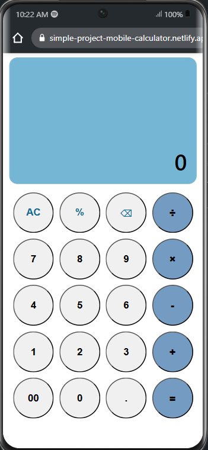

# Functional Calculator

  

A simple yet functional calculator application built from scratch using vanilla HTML, CSS, and JavaScript. This project was created as part of an intensive exercise to master fundamental front-end development concepts.

---

### ✨ Live Demo

You can try out the live calculator here:
**simple-project-mobile-calculator.netlify.app**

---

### 📸 Screenshots

<p align="center">
  <strong>Mobile View</strong><br>
  
</p>

---

### 🚀 Features

- **Basic Arithmetic Operations:** Addition (+), Subtraction (-), Multiplication (×), and Division (÷).
- **Chained Calculations:** Ability to perform continuous operations (e.g., `5 + 5 × 2 = 20`).
- **Functional Buttons:** Includes `AC` (All Clear), `⌫` (Backspace/Delete), and `%` (Percentage).
- **Decimal Support:** Capable of performing calculations with decimal numbers using the dot (.) button.
---

### 💻 Technologies & Concepts Applied

This project served as a practical exercise for a wide range of core technologies and concepts, including:

- **HTML5:** Using a clean and semantic document structure.
- **CSS3:**
    - **Mobile-First Responsive Design:** Designing for mobile first and adapting to larger screens.
    - **CSS Grid:** Utilized to create a precise and responsive calculator keypad layout.
    - **Flexbox:** Employed for content alignment within the display and other components.
    - **`aspect-ratio`:** A modern technique to create proportional, square buttons.
    - **Responsive Units (`vh`):** For setting the display height relative to the screen.
- **JavaScript (ES6+):**
    - **DOM Manipulation:** Selecting and dynamically manipulating HTML elements.
    - **Event Handling:** Managing all user inputs through `addEventListener`.
    - **State Management:** Managing the calculator's "memory" (`current`, `previous`, `operation`) to handle complex calculation logic.
    - **Functions & Logic:** Breaking down the code into reusable functions (`updateDisplay`, `compute`, `clear`).
    - **Error Handling:** Basic logic to prevent division by zero.

---

### 💡 Development Process & Lessons Learned

This project was an intensive problem-solving journey. The main challenge was designing a robust state management system to handle various user input scenarios, such as chained calculations and input corrections with backspace. The process of *refactoring* the code by separating logic into helper functions like `compute()` and `updateDisplay()` taught me the importance of writing clean, efficient, and maintainable code.

---

### ⚙️ Running Locally

To run this project on your local machine:
1.  Clone this repository:
    ```bash
    git clone [https://github.com/](https://github.com/)[YOUR_USERNAME]/[YOUR_REPO_NAME].git
    ```
2.  Navigate to the project directory:
    ```bash
    cd [YOUR_REPO_NAME]
    ```
3.  Open the `index.html` file in your browser.
